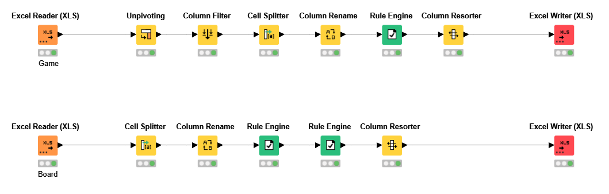
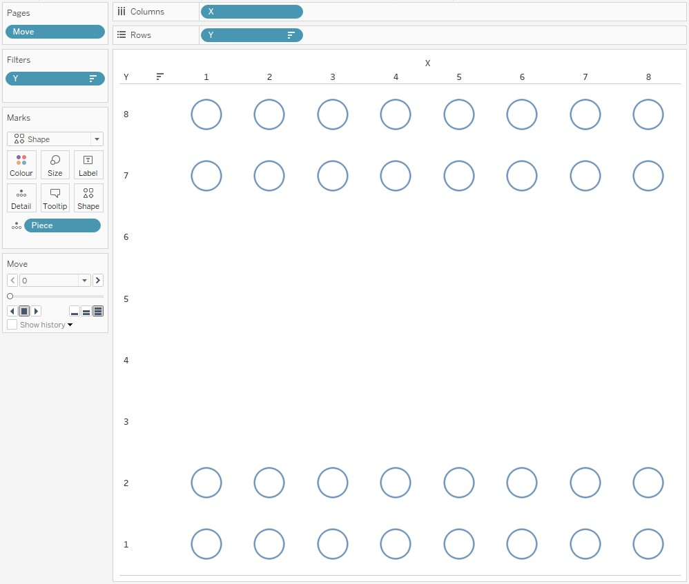
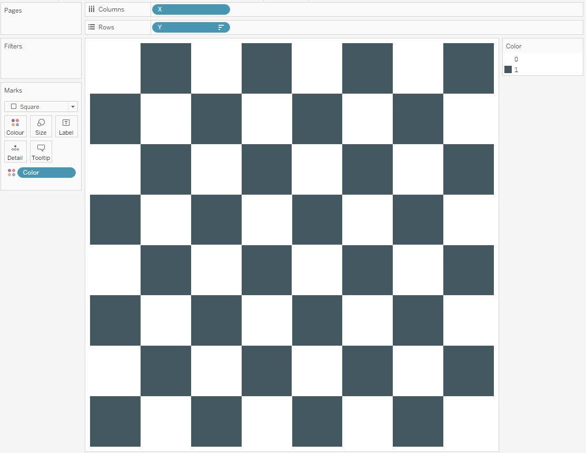
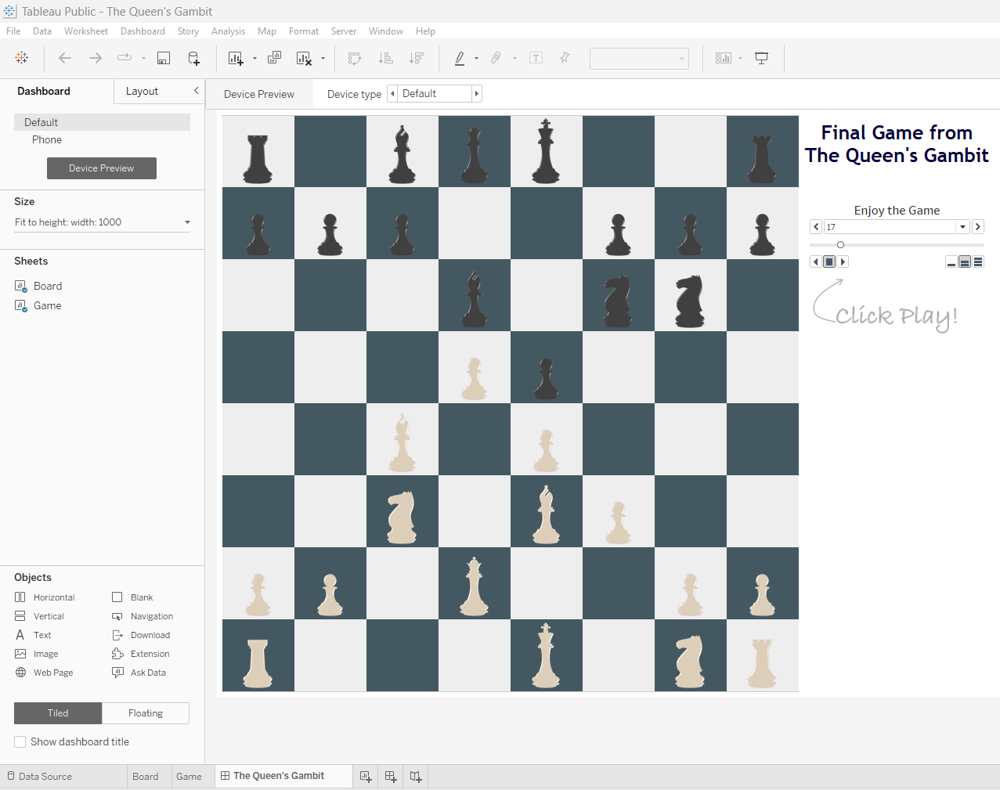

# Background

In data, I see a lot of potential and endless possibilities. This time, I decided to have some playful fun with it! After watching The Queen's Gambit on Netflix, I noticed that the games were played on huge boards, and I thought this was pretty cool. Can I recreate this with a data visualization tool? [(Tableau in this case)](https://bit.ly/43uqM7N). 

### Data Prepration

My first thought is where can I find the data? For Chess, you have Portable Game Notation (PGN) files for individual games (thousands of them cataloged and available for analysis), as well as websites where you can view them. [Click Here](https://lichess.org/study/AgKEky06)

Since I wanted to combine animations with page functionality, I figured I would need to capture the position of each piece on the board after each player moves. To get my data into the format I wanted, I used KNIME, a powerful ETL tool. You can find the final result, in the "cleaned data" folder. For the ELT workflow click this [link](https://hub.knime.com/-/spaces/-/latest/~oPVqKpLnTZCSeSNY/).

### The Game

Now that we've covered the functional part, let's move on. Yes, we can actually click play and watch the game, but it's a little hard to see what's going on. The next step is to get our chess icons (chess pieces). You can find these pieces in my "Diagrams" folder.

### The Board

We're going to set up our Chessboard on the Chess Grid sheet in the Excel Spreadsheet you downloaded

### [Final Result](https://bit.ly/3C0WqhG)

You can have a lot of fun with data if you apply it to your hobbies. Chess will be with me until I'm old? Who knows. I hope you learned something here. In any case, I hope you enjoyed this, and I've got some cool stuff coming